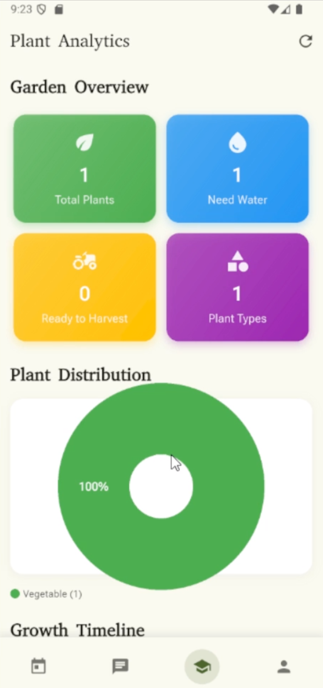
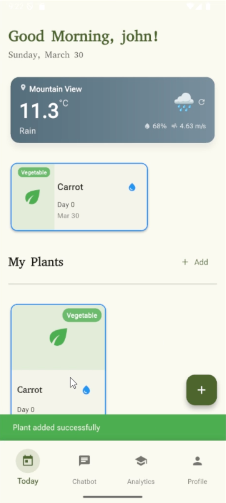
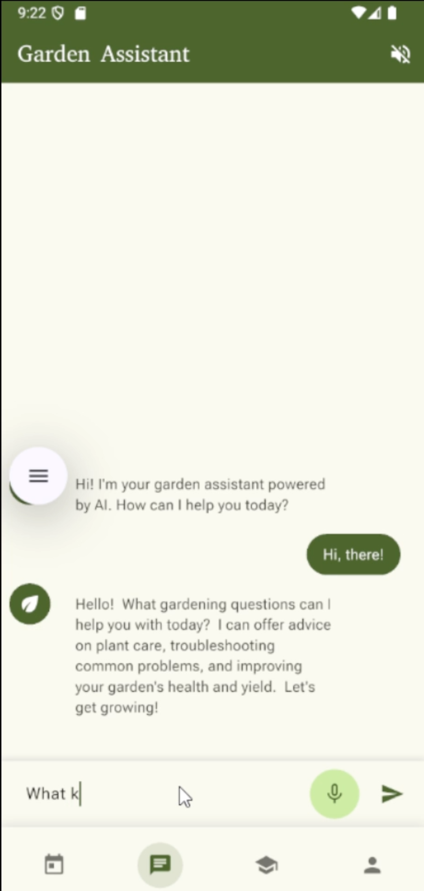

  

    <h1>【 Celeste 】</h1>
        <h3>Microgreens Tracking & Growth Management App</h3>

    <h2>• overview •</h2>
    <h3></h3>

  

    
    
<strong>Home Screen</strong>

  

  
  

    
    
<strong>Journal View</strong>

  

  
  

    
    
<strong>Analytics Dashboard</strong>

  

## About Celeste

Celeste is a cross-platform application designed to simplify and systematize the process of monitoring microgreens growth, maintaining phenological records, and storing data for analysis and forecasting. Track your plant growth journey with ease!

## Key Features

### 🌱 Microgreens Batch Management

- Register new batches with detailed information
- Track different types of microgreens (arugula, cress, mustard, etc.)
- Record sowing dates, substrate types, and expected harvest dates

### 📝 Growth Journal

- Daily/periodic entries for monitoring progress
- Photo uploads for visual comparison
- Track metrics like sprout height, watering schedules, and lighting conditions

### 📊 Analytics

- Countdown to expected harvest date
- Growth tracking and visualization
- Moisture history recording

### 🔔 Notifications & Tips

- Custom reminders for watering and daily inspections
- Quick tips to prevent mold and maintain optimal moisture levels

### 📚 Microgreens Library

- Database of popular varieties with growing recommendations
- Standard guidelines for germination periods, temperature, and lighting

## Tech Stack

- **Frontend**: Flutter (iOS, Android, Web)
- **Backend**: Python FastAPI backend ([celeste-backend](https://github.com/Rnbsov/celeste-backend))
  - Containerized with Docker for consistent deployment across environments
  - Uses [DragonFlyDB](https://www.dragonflydb.io/) (modern, faster Redis alternative) for high-performance caching
  - RESTful API endpoints with automatic OpenAPI documentation through modern Swagger alternative Scalar Api
- **Admin Panel**: NextJs with styling using [Tailwind](https://tailwindcss.com/), modern components library [shadcn/ui](https://ui.shadcn.com/), animations using [motion (previously framer-motion)](https://motion.dev/) ([celeste-admin](https://github.com/Rnbsov/celeste-admin))
- **Authentication**: Supabase Auth (with Google provider support)
- **Database**: Supabase PostgreSQL

> [!TIP]
> 🚀 Highly Modern Tech Stack designed for best experience and scalability

## Releases and CI/CD

This project uses GitHub Actions to automate the build and release process:

- **Automatic APK Building**: Every push to the main/master branch triggers an APK build
- **Release Creation**: APKs are automatically published as GitHub releases
- **Version Tagging**: Releases are tagged with version from pubspec.yaml and build timestamp
- **Release Notes**: Automatically generated release notes document changes

You can download the latest APK from the [Releases page](https://github.com/Rnbsov/celeste/releases).

> [!IMPORTANT]
> This project was crafted with ✨ love and passion ✨

  🍃 【 Happy Growing! 】👾

